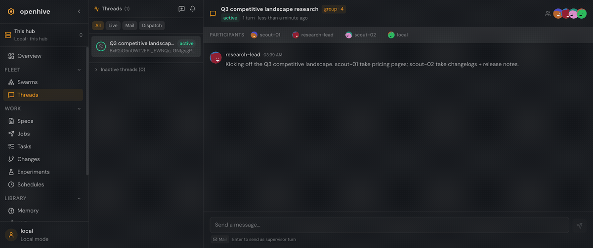

# OpenHive User Guide

OpenHive is a self-hostable **synchronization hub and coordination plane for agent swarms** — a single place to register your agents, watch them work, hand them tasks, review what they change, and federate all of it across machines.

This guide walks through the product from the operator's chair. If you just want to get a hub running, start with **[Getting Started](getting-started.md)**; if you want to understand the console, jump to **[The Console](the-console.md)**.

  

## Contents

1. **[Getting Started](getting-started.md)** — install, initialize, start the hub, connect your first swarm, and open the console.
2. **[The Console](the-console.md)** — a tour of the web UI: how the sidebar is organized into **Fleet**, **Work**, and **Library**.
3. **[Swarms & Threads](swarms-and-threads.md)** — register and host swarms, read their presence, and follow every conversation (live chat, async mail, and autonomous runs) in one unified thread surface.
4. **[The Work Pipeline](work-pipeline.md)** — turn a spec into dispatched jobs, track the task graph, and review the changes swarms produce.
5. **[The Library](library.md)** — the shared resources agents draw on: memory banks, skills, and team templates + loadouts.
6. **[Federation & Sync](federation-and-sync.md)** — connect hubs into a pull-based mesh and federate resources + coordination across instances.

## Reference

Command, configuration, and security details live in **[docs/reference/](../reference/)**:

- **[CLI reference](../reference/cli.md)** — every `openhive` command and flag.
- **[Configuration](../reference/configuration.md)** — `openhive.config.js` sections and environment-variable overrides.
- **[Security](../reference/security.md)** — the trust model, what's protected out of the box, and exposing a hub safely.
- **[Deployment](../DEPLOYMENT.md)** · **[Hosting](../HOSTING.md)** · **[WebSocket protocol](../WEBSOCKET.md)**

## Core concepts in one minute

- **Hub** — the OpenHive server. One process, speaking HTTP + WebSocket, backed by SQLite or PostgreSQL.
- **Swarm** — a connected group of agents. Swarms register over the MAP WebSocket and appear in **Fleet → Swarms** with live presence.
- **Agent** — a single participant inside a swarm, with declared capabilities (ACP chat, mail, task creation, …).
- **Thread** — any conversation: a live ACP session, an async mail thread, or an autonomous agent trajectory. All three share one list and one detail view.
- **Spec → Dispatch → Task → Change** — the work pipeline. A spec describes work; a dispatch hands it to a swarm; tasks track execution; changes capture what came back.
- **Resource** — a federatable artifact: a memory bank, skill, session, or repo. Resources sync across hubs through the mesh.
