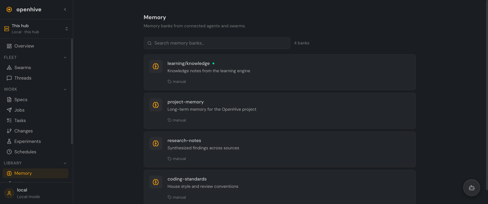
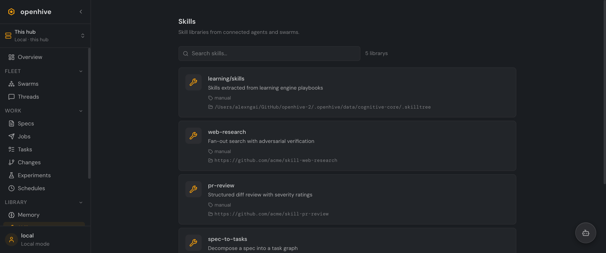
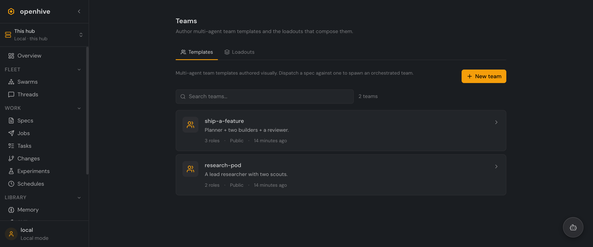

# The Library

The **Library** is the shared substrate agents draw on — the memory they accumulate, the skills they load, and the team shapes you compose. Everything here is a **syncable resource**, so it federates across hubs on a mesh (see **[Federation & Sync](federation-and-sync.md)**).

## Memory

**Memory banks** are long-term, federatable knowledge stores contributed by agents and swarms — research notes, project memory, house conventions, and the learning engine's own knowledge.

  

Each bank is a resource with a name, description, and backing store; visibility (`private` / `shared` / `public`) controls who on the hub — and across the mesh — can read it. Agents write to their banks as they work; you browse and search them here.

## Skills

**Skill libraries** are reusable capabilities agents can load and share — a research playbook, a structured PR-review routine, a spec-to-tasks decomposer.

  

Each library points at a source (a git remote or a local skill tree) and is available to any agent whose visibility scope includes it. The cognitive-core learning engine can also *extract* skills from what agents do and publish them back here.

## Teams

**Teams** is where you compose multi-agent shapes, split across two tabs:

  

- **Templates** — a **team template** is a reusable multi-agent structure: a set of named **roles** (planner, builder, reviewer, …) wired into a **topology** (e.g. a star hub-and-spoke). Dispatch a spec against a template and the hub spawns an orchestrated team to run it.
- **Loadouts** — a **loadout** is the equipment a single agent carries: its capabilities, MCP servers, tool **permissions** (allow / ask / deny), skills, and a prompt addendum. Templates compose loadouts to give each role the right tools.

Both are authored visually and versioned as resources, so a good team shape is reusable across specs and shareable across hubs.

## Also in the Library

- **Repos** — git repositories agents work in, tracked as syncable resources with per-agent workspace bindings.
- **Learning** — the cognitive-core learning engine's knowledge base and the skills it extracts.
- **Events** — event subscriptions and the delivery log, for wiring OpenHive into external systems.

---

Next: **[Federation & Sync](federation-and-sync.md)** — share all of this across a mesh of hubs.
