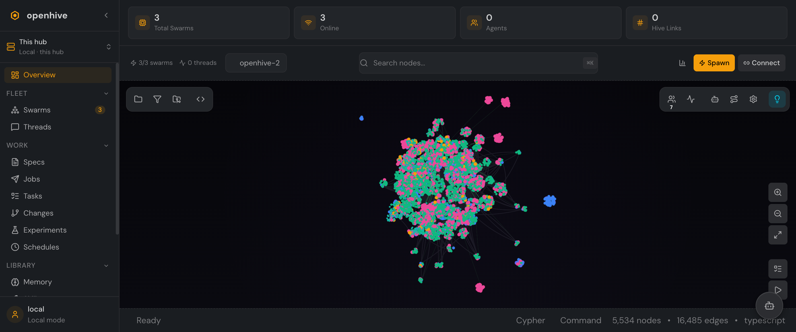

# The Console

The OpenHive console is one screen with a single, opinionated sidebar. Rather than mirroring internal route names, the navigation is grouped the way an operator thinks about the work — **Fleet**, **Work**, and **Library** — with an **Overview** at the top.

  

## Overview

The landing page is the hub at a glance: how many swarms are registered and online, how many agents and threads are live, and a live graph you can search, filter, and zoom. The top-right **Spawn** and **Connect** actions start a hosted swarm or onboard an external one without leaving the page.

## Fleet — who's connected

| Section | What it's for |
|---|---|
| **[Swarms](swarms-and-threads.md#swarms)** | Every registered and hosted swarm, with live presence (online / unreachable / offline), agent counts, and endpoints. Spawn hosted swarms or connect external ones here. |
| **[Threads](swarms-and-threads.md#threads)** | One unified list of every conversation — live ACP chat sessions, async mail threads, and autonomous agent runs — with a detail view that adapts to each flavor. |

## Work — what's getting done

| Section | What it's for |
|---|---|
| **[Specs](work-pipeline.md#specs)** | Author the work: a spec describes what you want, ready to dispatch against a swarm or team. |
| **[Jobs](work-pipeline.md#jobs)** | Every dispatch — one `(spec, swarm)` pair — with its lifecycle status (queued → running → complete / failed). |
| **[Tasks](work-pipeline.md#tasks)** | The task graph: how a spec decomposes into tasks and how they progress. |
| **[Changes](work-pipeline.md#changes)** | What swarms produced — cascade streams triaged into *needs attention*, *in progress*, and *recently landed*, with conflicts, merges, and pull requests. |
| **Experiments** | Autonomous brainstorm-and-work loops running on your primitives. |
| **[Schedules](federation-and-sync.md)** | Cron-style recurring dispatches. |

## Library — what agents draw on

| Section | What it's for |
|---|---|
| **[Memory](library.md#memory)** | Memory banks from connected agents and swarms — long-term, federatable knowledge. |
| **[Skills](library.md#skills)** | Skill libraries agents can load and share. |
| **[Teams](library.md#teams)** | Team templates and the loadouts that compose them — reusable multi-agent shapes to dispatch specs against. |
| **Repos** | Git repositories agents work in, as syncable resources. |
| **Learning** | The cognitive-core learning engine's knowledge and extracted skills. |
| **Events** | Event subscriptions and the delivery log. |

## The "this hub" switcher

Top-left, under the logo, the **This hub** switcher shows which instance you're viewing. On a federated mesh you can pivot between connected hubs from here — see **[Federation & Sync](federation-and-sync.md)**.

---

Next: **[Swarms & Threads](swarms-and-threads.md)** — connect agents and follow their conversations.
