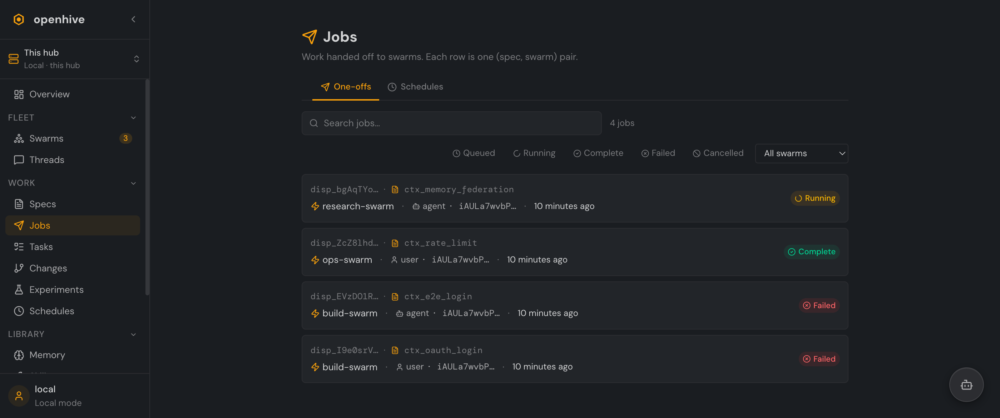
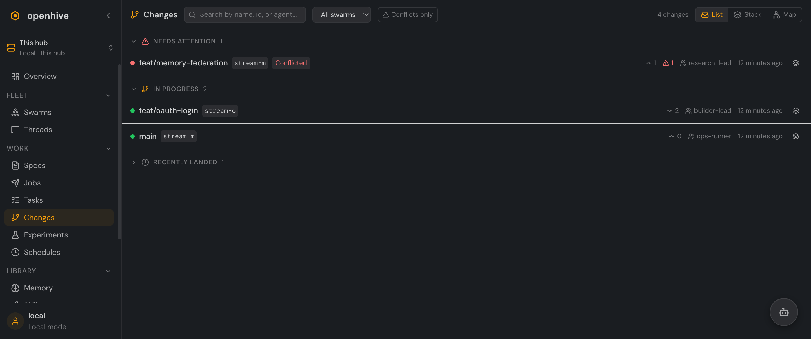

# The Work Pipeline

OpenHive turns intent into reviewed output through a four-stage pipeline, each with its own page under **Work**:

```
Specs  →  Jobs (dispatch)  →  Tasks  →  Changes
 what        hand to a swarm    execution   what came back
```

## Specs

A **spec** describes a unit of work — a goal, acceptance criteria, context. Specs live in the hub's task graph and carry a discussion thread of their own. From a spec you **dispatch** against a swarm or a [team template](library.md#teams) to put agents on it. The **Specs** page lists your specs with their status and lets you author new ones.

## Jobs

A **job** (dispatch) is one `(spec, swarm)` pairing — the concrete act of handing work off. The **Jobs** page is the operator's queue: every dispatch, newest first, filterable by status and swarm.

<p align="center">
  
</p>

Each row shows the spec, the target swarm, who initiated it (a user or an agent), when, and a status chip that walks the lifecycle:

- **Queued** → picked up by the orchestrator
- **Running** → an agent is on it
- **Complete** → finished, with an outcome summary and any artifacts (e.g. a linked pull request)
- **Failed** / **Cancelled** → with the error captured

The orchestrator polls dispatches and routes each to its swarm over ACP or mail. A second tab, **Schedules**, holds cron-style recurring dispatches.

## Tasks

Where a job is the hand-off, **Tasks** is the execution graph. A spec decomposes into a task graph — nodes in states like `open`, `in progress`, `blocked`, `completed`, and `failed` — and the Tasks page renders each graph as a card with live status counts, plus a graph view for the structure. Agents read and update the graph as they work, so the page is a real-time picture of progress.

## Changes

When swarms produce code, it surfaces here as **cascade streams** — hub-local lenses over what each swarm is changing. The **Changes** page triages every stream into three buckets so you always know where to look first:

<p align="center">
  
</p>

- **Needs attention** — conflicted streams, open conflicts front and center.
- **In progress** — active streams accumulating commits.
- **Recently landed** — merged in the last few days.

Each row shows the branch name, its stream id, commit count, conflict count, the authoring agent, and when it last moved. Toggle between the triaged **List**, a graphite-style **Stack**, and a branch **Map** (the DAG of parents, children, and merges). Click a stream to open its detail panel — status, agent, commit history, the branch, a **Stream diff**, and one-click actions (pause, abandon, open a PR).

---

Next: **[The Library](library.md)** — the memory, skills, and team shapes agents draw on across the pipeline.
